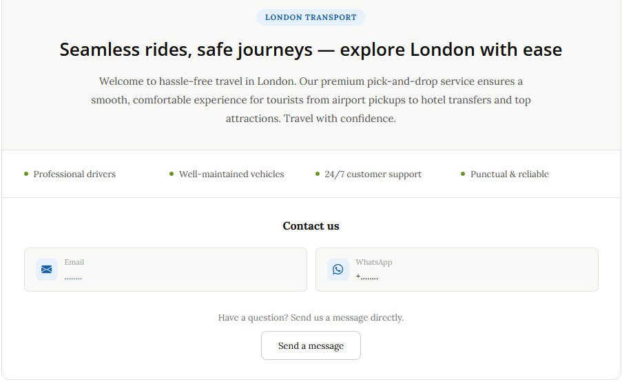
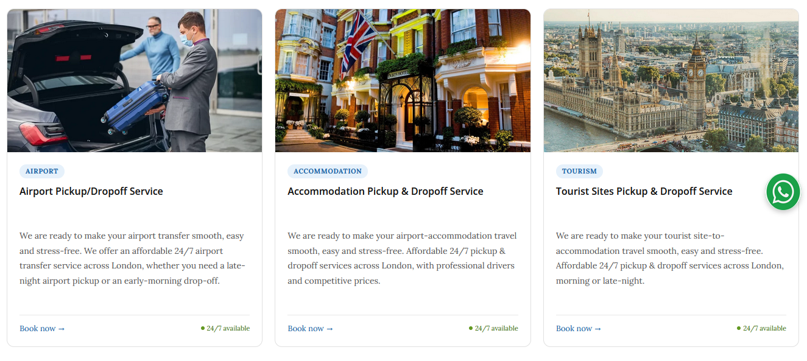
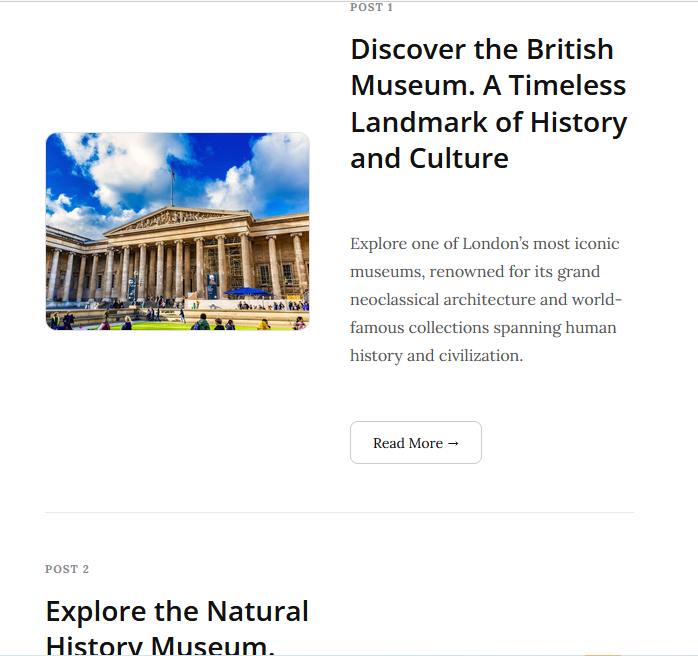
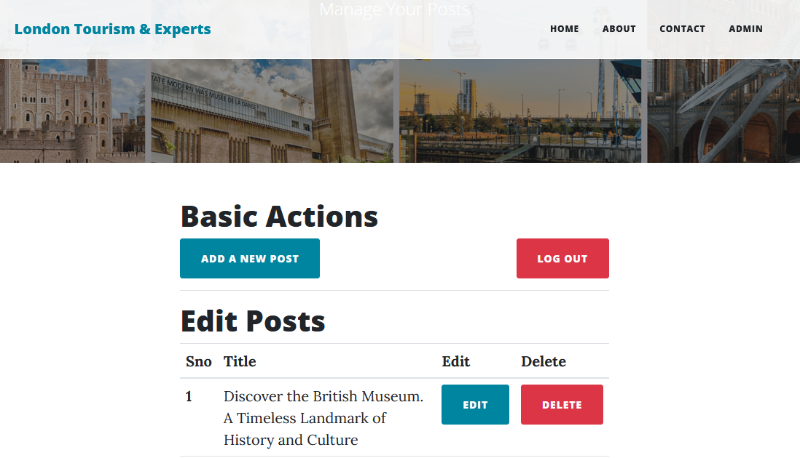

# 🚖 London Tourism & Transport — Full-Stack Web Application

A production-ready, fully dynamic web application built for a London-based 
tourist pick-and-drop service. Designed to modern UI/UX standards with a 
secure admin control interface for complete content management.

---

## ✨ Features

- **Responsive UI** — Mobile-first design that adapts seamlessly across all 
  screen sizes and devices
- **Dynamic Content** — Posts and service listings are fetched directly from 
  a live database with pagination support
- **Alternating Post Layout** — Clean image-text layout that alternates 
  per post for an engaging reading experience
- **Admin Dashboard** — Secure control panel allowing the admin to create, 
  edit, and delete posts in real time
- **Authentication** — Protected admin routes to prevent unauthorised access
- **SEO-Friendly Slugs** — Human-readable URLs generated automatically for 
  every post
- **Optimised Card Components** — Service cards with responsive typography, 
  trust signals, and clear CTAs
- **About & Contact Pages** — Purpose-built pages designed to build user 
  trust and drive enquiries

---

## 🛠️ Tech Stack

| Layer       | Technology                          |
|-------------|--------------------------------------|
| Backend     | Python, Flask, SQLAlchemy            |
| Frontend    | HTML5, CSS3, Bootstrap 5, Jinja2     |
| Database    | MySQL                                |
| Icons       | Bootstrap Icons                      |

---

## 📸 Screenshots





---

## 🚀 Getting Started

### Prerequisites
- Python 3.8+
- pip

### Installation

```bash
# Clone the repository
git clone https://github.com/20Hamidullah/London-Tourism---Experts-Flask-Python-Project.git
cd London-Tourism---Experts-Flask-Python-Project

# Create a virtual environment
python -m venv venv
source venv/bin/activate       # Windows: venv\Scripts\activate

# Install dependencies
pip install -r requirements.txt

# Run the application
flask run
```

### Admin Access
Navigate to `/admin` and log in with the following admin logini credentials to access 
the post management dashboard.
-username: admin
password: admin

---

## 📁 Project Structure

london-tourism/
├── static/
│   ├── assets/img/          # Post and service images
│   └── css/                 # Custom stylesheets
├── templates/
│   ├── layout.html            # Base layout
│   ├── index.html           # Homepage with paginated posts
│   ├── about.html           # About us page
│   ├── contact.html         # Contact page
│   └── admin/               # Admin dashboard templates
├── main.py                   # Main Flask application

## 👤 Author

**Sayed Hamidullah Fazlly**  
[LinkedIn](www.linkedin.com/in/sayed-hamidullah-fazlly-382489170) · 

